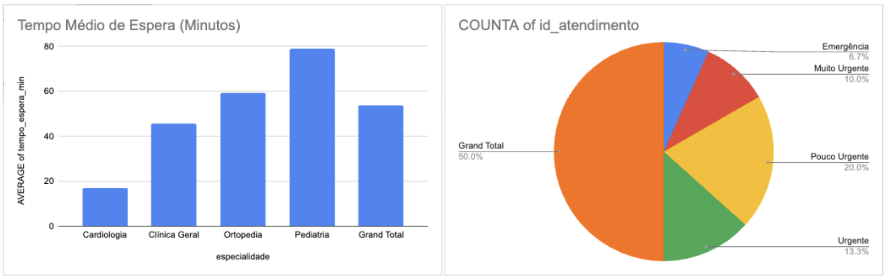

# 📊 Painel Executivo de Gestão Hospitalar & Tempo de Espera

> Projeto de Análise de Dados voltado para a otimização do fluxo de atendimento e redução de gargalos na Rede HU / EBSERH.

---

## 📌 Visão Geral do Painel

### 🎯 KPIs Analisados:
1. **Tempo Médio de Espera (TME):** Medido em minutos por especialidade e urgência.
2. **Volume por Prioridade:** Distribuição de casos segundo o Protocolo de Manchester.
3. **Satisfação do Paciente:** Escala de 1 a 5 correlacionada ao tempo em fila.

---

## 🛠️ Tecnologias
* **Google Sheets / Business Intelligence:** Tratamento, agregação de dados e geração de gráficos.
* **Estruturação de Dados:** Arquivo CSV padronizado.